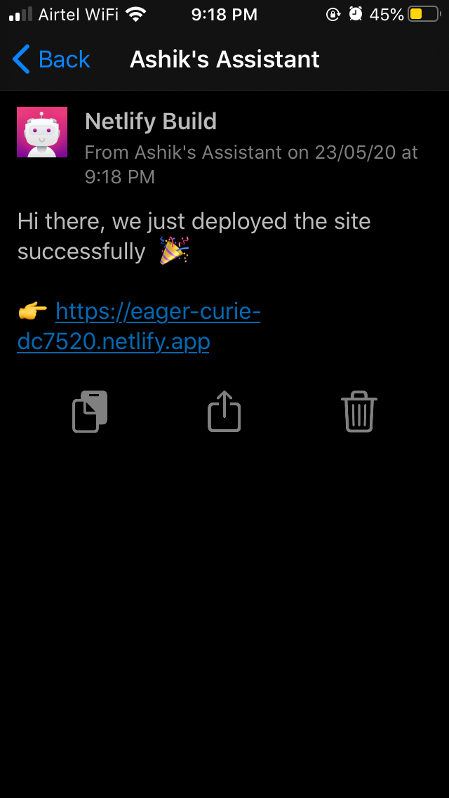

# Netlify Pushover Deploy Plugin

After a successful/error build send real-time notifications to your Android,
iPhone, iPad, and Desktop via [Pushover](http://pushover.net)

## Usage

To include this plugin in your site deployment:

### 1. Add the plugin as a dependency

```sh
# Add the plugin as a dependency to your build
npm i --s netlify-plugin-pushover
```

### 2. Add the plugin as a dependency

Add the following lines to your netlify.toml configuration file:

```
[[plugins]]
package = "netlify-build-plugin-pushover"

  [plugins.inputs]
    successMessage = "" #Optional
    errorMessage = "" #Optional
```

Note: The [[plugins]] line is required for each plugin, even if you have other
plugins in your netlify.toml file already.

#### Inputs

You can overide the default messages using inputs.

| Input          | Type   | Default Value                                                               |
| -------------- | ------ | --------------------------------------------------------------------------- |
| successMessage | String | Hi there, we just deployed the site successfully 🎉                         |
| errorMessage   | String | Hi there, Latest build failed 😱\n\nCheck your build's log for more details |

Note: Site URL depending upon deploy context will be appended to both the
messages.

```
# netlify.toml
# Production context:
[context.production]

  [[context.production.plugins]]
    package = "netlify-build-plugin-pushover"

      [context.production.plugins.inputs]
        successMessage="Success msg from Production"
        errorMessage="Error msg from Production"


# Deploy Preview context:
[context.deploy-preview]

  [[context.deploy-preview.plugins]]
    package = "netlify-build-plugin-pushover"

      [context.deploy-preview.plugins.inputs]
        successMessage="Success msg from deploy preview"
        errorMessage="Error msg from deploy preview"

```

### 3. Set the environmental variable in Netlify

Get the api credentials from [Pushover](https://pushover.net/api) and set it as
an environmental variable in
[Netlify](https://docs.netlify.com/configure-builds/get-started/#build-environment-variables)

-   PUSHOVER_USER_KEY
-   PUSHOVER_API_TOKEN

If those variables are not present, the build will continue without sending push
notification


## Demo

Once configured everything, you'll start getting notifications like this in your
device




## Reference

-   [Creating and using your first Netlify Build Plugin](https://www.netlify.com/blog/2019/10/16/creating-and-using-your-first-netlify-build-plugin)
